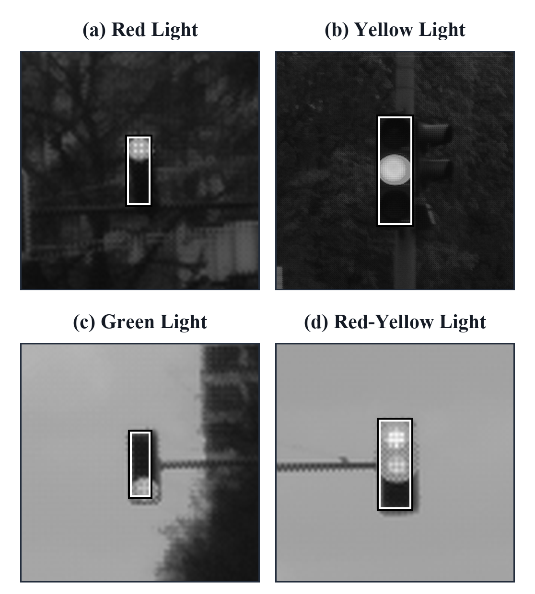
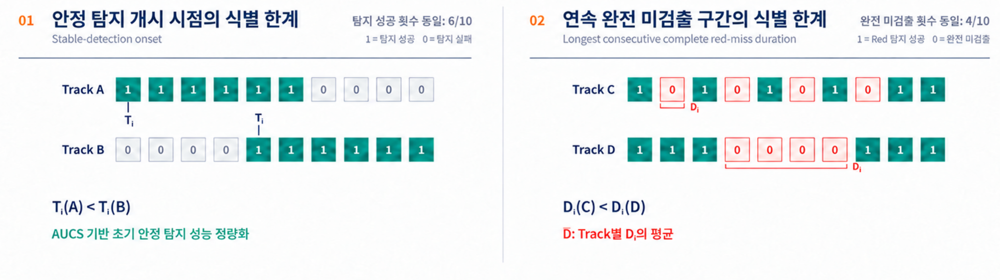
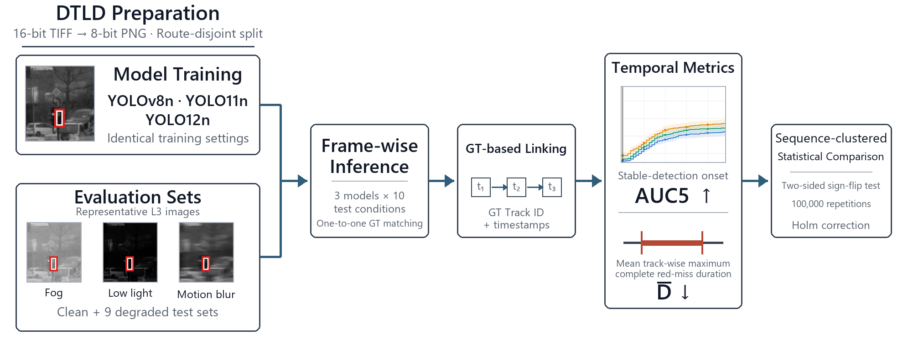
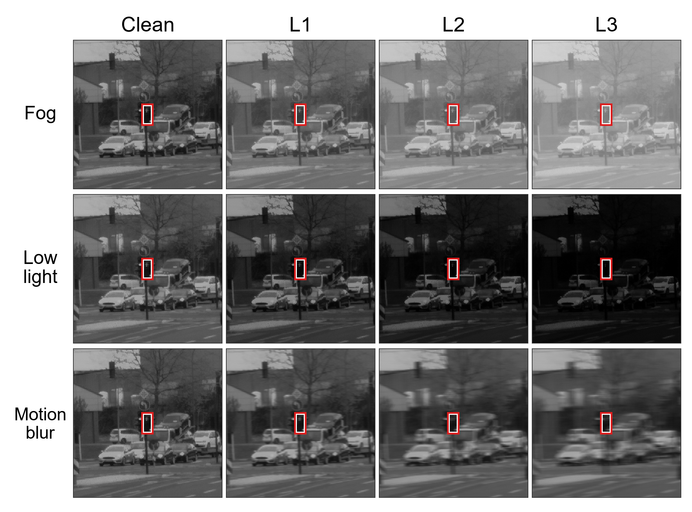
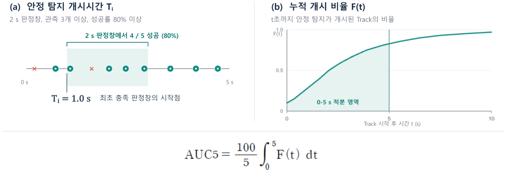
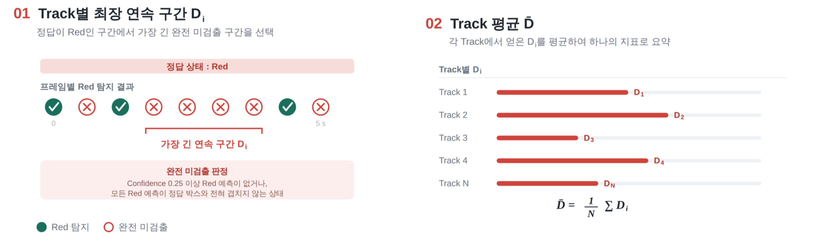
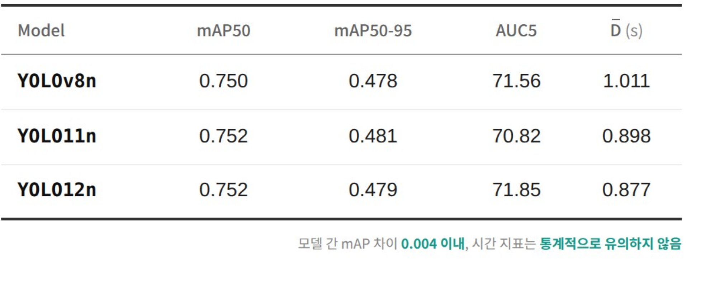
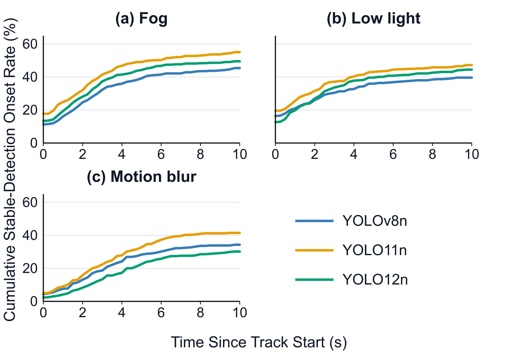
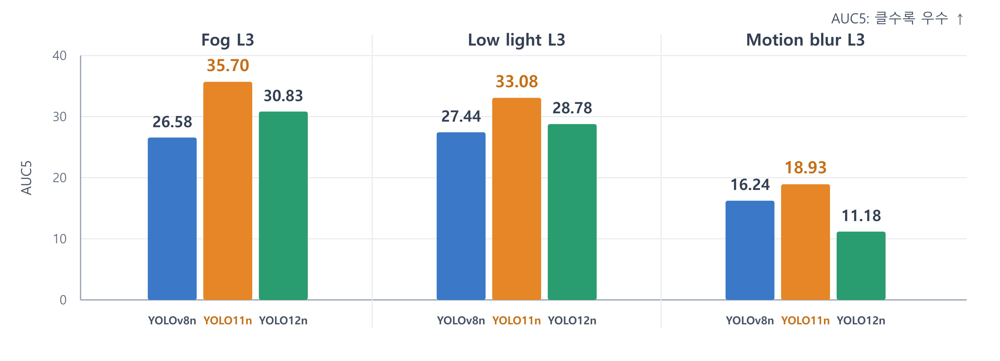
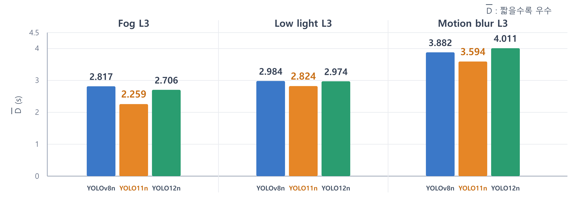

# 🥇 ACK2026.09.22_YOLO_Traffic_Light_Temporal_Robustness

---

### Temporal Robustness Evaluation of YOLO-Based Traffic Light Detection under Synthetic Degradations

-저자: 최승범, 설재훈, 김동현, 김재원, 오준석, 김영균


- 비교 모델: **YOLOv8n, YOLO11n, YOLO12n**
- 데이터셋: **DTLD (DriveU Traffic Light Dataset)**

기존 객체 탐지 평가는 주로 Precision, Recall, mAP와 같은 **프레임 단위 지표**에 의존한다. 그러나 연속 주행 환경에서는 신호등을 얼마나 이른 시점부터 안정적으로 탐지하는지와, 중요한 적색 신호를 얼마나 오래 연속으로 놓치는지도 중요하다.

본 연구에서는 DTLD 주행 시퀀스에서 YOLOv8n, YOLO11n, YOLO12n의 예측을 Track 단위로 연결하고, **AUC5**와 $\mathbf{\bar{D}}$를 이용하여 합성 열화 조건에서의 시간적 강건성을 비교하였다.

---

# 1. 데이터셋

독일 11개 도시의 실주행 환경에서 수집된 **DTLD (DriveU Traffic Light Dataset)** 활용



- 탐지 대상: **Red / Yellow / Green / Red-Yellow**
- 원본 영상: **2048 × 1024, 16-bit TIFF**
- 모든 프레임에 동일한 선형 변환을 적용하여 **8-bit 단일채널 PNG**로 변환
- 연속 프레임에 의한 데이터 누수를 방지하기 위해 **주행 경로 단위로 Train / Validation / Test 분할**
- 분할 간 동일 주행 경로 중복 없음

**Train / Validation / Test**

> Train : 34 routes / 32,699 images
>
> Validation : 4 routes / 4,035 images
>
> Test : 5 routes / 4,244 images

**비교 모델**

> YOLOv8n / YOLO11n / YOLO12n
>
> 세 모델 모두 동일 데이터 및 학습 조건 적용

---

# 2. 문제 제기

## 기존 프레임 단위 평가의 한계



- Precision, Recall, mAP는 **프레임별 탐지 결과를 전체 데이터에서 집계**
- 전체 탐지 성공 횟수가 같더라도 **안정 탐지가 시작되는 시점은 다를 수 있음**
- 전체 미검출 횟수가 같더라도 **짧게 분산된 오류와 연속된 오류는 시간적으로 다른 특성**
- 따라서 프레임 단위 정확도만으로는 주행 시퀀스의 **시간적 탐지 특성**을 충분히 표현하기 어려움

### 핵심 연구 질문

> **Clean 환경에서 mAP가 유사한 모델도 합성 열화가 적용된 주행 시퀀스에서는 서로 다른 시간적 강건성을 보이는가?**

---

# 3. 실험 구성

동일 조건에서 학습된 세 YOLO 모델을 Clean 및 합성 열화 환경에서 평가하고, 프레임별 예측을 Track 단위 시계열로 재구성하여 시간적 성능을 비교



## 전체 평가 절차

- YOLOv8n / YOLO11n / YOLO12n을 **동일 조건으로 학습**
- Clean + 9개 합성 열화 조건에서 **프레임별 추론 수행**
- 정답 **Track ID와 timestamp**를 이용해 동일 신호등의 예측을 시간순으로 연결
- Track 단위 시간적 지표 **AUC5 / $\mathbf{\bar{D}}$** 산출
- 동일 주행 시퀀스 내부의 상관을 고려하여 **통계 비교**

---

## Synthetic Degradation



원본 Test 영상에 **Fog / Low-light / Motion blur**를 각각 3단계로 적용하였다.

### ① Fog

원본 영상과 백색 대기광을 혼합하여 안개 영상을 생성하였다.

```math
I_{\mathrm{fog}}=(1-\alpha)I+255\alpha
```

**강도 증가 방향:** α ↑ → 안개 강도 증가

---

### ② Low-light

감마 변환을 이용하여 저조도 영상을 생성하였다.

```math
I_{\mathrm{low}}
=
255
\left(
\frac{I}{255}
\right)^{\gamma}
```

**강도 증가 방향:** γ ↑ → 영상 밝기 감소

---

### ③ Motion blur

모든 원소가 **1/k**인 수평 평균 커널을 적용하여 모션블러를 생성하였다.

```math
I_{\mathrm{blur}}=I*h_k
```

**강도 증가 방향:** k ↑ → 블러 강도 증가

---

### 열화 강도

| 열화 조건 | L1 | L2 | L3 |
|---|---:|---:|---:|
| Fog (α) | 0.15 | 0.30 | 0.45 |
| Low-light (γ) | 1.4 | 2.0 | 2.8 |
| Motion blur (k, px) | 3 | 7 | 11 |

### 평가 조건

- 동일 시퀀스의 모든 프레임에 **동일한 열화 파라미터 적용**
- 변환 전후 영상 좌표계가 동일하므로 기존 **Ground-Truth Label 및 Bounding Box 유지**
- 모델의 학습 가중치 고정
- **열화 조건별 재학습 없음**
- Clean 포함 총 **10개 Test 조건 × 3개 모델**

> L1–L3는 본 연구에서 설정한 상대적 열화 강도이며, 서로 다른 열화 종류의 물리적 심각도가 동일함을 의미하지 않음.

---

# 4. 시간적 평가 지표

기존 프레임 단위 평가를 보완하기 위해 동일 신호등의 예측을 Track 단위로 연결하고, 두 가지 시간적 지표를 산출하였다.

---

## 4.1 Stable-Detection Onset — AUC5



### Frame-level Detection Success

각 프레임에서 다음 조건을 모두 만족하면 탐지 성공으로 판정한다.

- Confidence score ≥ **0.25**
- IoU ≥ **0.50**
- 예측 신호 상태와 정답 상태 일치

### Stable-Detection Onset

- 각 Track의 최초 관측 시점을 **0 s**로 정렬
- 각 관측 시점부터 시작하는 **2 s 판정창** 사용
- 판정창 내 **최소 3개 관측**
- 탐지 성공률 **80% 이상**
- 조건을 처음 만족한 판정창의 시작 시점 = **Tᵢ**
- 안정 탐지가 개시되지 않은 Track은 **Tᵢ = ∞**로 처리

시간 t까지 안정 탐지가 개시된 Track의 누적 비율을 다음과 같이 정의한다.

```math
F(t)
=
\frac{1}{N}
\sum_{i=1}^{N}
I(T_i \leq t)
```

- **N** : 평가 가능한 전체 Track 수
- **I(·)** : 조건 만족 여부를 나타내는 지시함수

누적 안정 탐지 개시 곡선의 **0–5 s 구간 면적**을 0–100 범위로 정규화하여 AUC5를 산출한다.

```math
AUC5
=
\frac{100}{5}
\int_{0}^{5}
F(t)\,dt
```

> **AUC5 ↑ : 더 많은 Track에서 안정 탐지가 조기에 개시**

> Evaluation : **434 Tracks / 160 sequences**

---

## 4.2 Complete Red-Miss Duration — D̄



### Complete Red-Miss

정답 상태가 Red인 프레임에서 다음 중 하나에 해당하면 **완전 미검출**로 판정한다.

- Confidence score ≥ **0.25**인 Red 예측이 없거나
- 존재하는 모든 Red 예측이 정답 Bounding Box와 **전혀 겹치지 않는 경우**

각 Red Track에서 연속 완전 미검출이 발생한 구간 중 가장 긴 지속시간을 **Dᵢ**로 정의한다.

```math
D_i
=
\max_{e \in E_i}
\left[
t_{\mathrm{end}}(e)
-
t_{\mathrm{start}}(e)
\right]
```

- **Eᵢ** : i번째 Red Track에서 발생한 연속 완전 미검출 구간의 집합

각 Track에서 얻은 Dᵢ를 전체 Red Track에 대해 평균하여 모델별 대표값 **\mathbf{\bar{D}}**를 산출한다.

```math
\mathbf{\bar{D}}
=
\frac{1}{N_R}
\sum_{i=1}^{N_R}
D_i
```

- **Nᵣ** : 평가 대상 Red Track의 수

> **$\mathbf{\bar{D}}$ ↓ : 적색 신호의 장시간 연속 완전 미검출이 적음**

> Evaluation : **198 Tracks / 80 sequences**

---

# 5. 실험 결과

## 5.1 Clean Baseline Performance



| Model | mAP50 | mAP50-95 | AUC5 | $\mathbf{\bar{D}}$ (s) |
|---|---:|---:|---:|---:|
| YOLOv8n | 0.750 | 0.478 | 71.56 | 1.011 |
| YOLO11n | 0.752 | 0.481 | 70.82 | 0.898 |
| YOLO12n | 0.752 | 0.479 | 71.85 | 0.877 |

- 두 mAP 지표의 모델 간 차이는 모두 **0.004 이내**
- AUC5와 D̄의 모델 간 대응 비교에서도 **Holm 보정 후 유의한 차이 없음**
- YOLO12n이 두 시간적 지표에서 **수치상 가장 양호**
- 그러나 Clean 조건에서는 **특정 모델의 시간적 우위를 뒷받침할 통계적 근거가 확인되지 않음**

> **Clean 조건에서는 프레임 단위 및 시간적 성능에서 뚜렷한 모델 우위가 확인되지 않음**

---

## 5.2 Stable-Detection Onset Curves



- 각 열화의 최고 강도인 **L3 조건**에서 누적 안정 탐지 개시 곡선 비교
- 곡선이 **높고 빠르게 상승할수록** 더 많은 Track에서 조기에 안정 탐지가 개시
- Fog / Low-light / Motion blur L3 모두에서 **YOLO11n의 곡선이 가장 높게 형성**
- 본 연구에서 설정한 세 L3 조건 중 **Motion blur에서 모든 모델의 곡선이 가장 낮게 나타남**

> 서로 다른 열화의 L3는 물리적으로 동일한 심각도를 의미하지 않으므로, 열화 종류 간 절대적 위험도 비교로 해석하지 않음.

---

## 5.3 L3 AUC5 Comparison



| Condition | YOLOv8n | YOLO11n | YOLO12n |
|---|---:|---:|---:|
| Fog L3 | 26.58 | **35.70** | 30.83 |
| Low-light L3 | 27.44 | **33.08** | 28.78 |
| Motion blur L3 | 16.24 | **18.93** | 11.18 |

- YOLO11n이 **Fog / Low-light / Motion blur L3 모두에서 가장 높은 AUC5 기록**
- YOLO11n과 나머지 두 모델의 직접 비교 **6개 중 5개가 통계적으로 유의**
- 유일한 비유의 비교
  - Motion blur L3
  - YOLO11n vs. YOLOv8n
  - 차이 : **2.69**
  - Holm-adjusted p = **0.154**

> 최고 강도 합성 열화 조건에서 **YOLO11n의 조기 안정 탐지 성능이 가장 일관된 수치상 순위**를 보임

---

## 5.4 L3 Red-Miss Duration Comparison



| Condition | YOLOv8n | YOLO11n | YOLO12n |
|---|---:|---:|---:|
| Fog L3 | 2.817 s | **2.259 s** | 2.706 s |
| Low-light L3 | 2.984 s | **2.824 s** | 2.974 s |
| Motion blur L3 | 3.882 s | **3.594 s** | 4.011 s |

- YOLO11n은 세 L3 조건 모두에서 **$\mathbf{\bar{D}}$가 수치상 가장 짧음**
- **Fog / Motion blur**
  - YOLO11n과 다른 두 모델의 차이 모두 통계적으로 유의
- **Low-light**
  - 모델 간 차이는 통계적으로 유의하지 않음
- Motion blur L3에서 YOLO12n의 D̄는 **4.011 s**로 세 모델 중 가장 길게 나타남

> D̄의 모델 간 차이는 **열화 종류에 따라 다르게 나타남**

---

## 5.5 Statistical Validation

모델 간 수치 차이가 동일 주행 시퀀스 내부 Track의 상관관계에 의해 과대평가되지 않도록 시퀀스 단위 통계 검정을 수행하였다.

- 동일 주행 시퀀스 내 Track 간 상관을 고려
- **Two-sided sequence-cluster sign-flip test**
- **100,000 repetitions**
- 다중비교는 **Holm correction**
- 유의수준 : **adjusted p < 0.05**

### Pairwise Comparison Summary

**AUC5**

> YOLO11n vs. 나머지 두 모델  
> 총 **6개 비교 중 5개 유의**

**$\mathbf{\bar{D}}$**

> Fog L3 : **2개 비교 모두 유의**
>
> Low-light L3 : **2개 비교 모두 비유의**
>
> Motion blur L3 : **2개 비교 모두 유의**

---

## 5.6 Sensitivity Analysis

평가 결과가 특정 임계값 선택에만 의존하는지 확인하기 위해 **한 번에 하나의 평가 기준만 변경**하고 나머지는 기본값으로 유지하였다.

### AUC5

- Confidence score : **0.10 / 0.25 / 0.50**
- IoU : **0.30 / 0.40 / 0.50**
- Evaluation window : **1 / 2 / 3 s**
- 기본 설정 중복 제외 총 **21개 평가 설정**
- **21 / 21 설정에서 YOLO11n이 수치상 가장 높은 AUC5 기록**

### $\mathbf{\bar{D}}$

- Confidence score : **0.10 / 0.25 / 0.50**
- 총 **9개 평가 설정**
- **8 / 9 설정에서 YOLO11n이 수치상 가장 짧은 D̄ 기록**
- 유일한 순위 변화
  - Low-light L3
  - Confidence score = 0.10
  - YOLO12n이 YOLO11n보다 **0.002 s 짧음**

> **21/21과 8/9는 통계적 유의성 횟수가 아니라 수치상 순위의 일관성을 의미함**

---

# 6. 결론

- Clean 조건에서는 세 모델의 mAP가 유사하고 시간적 지표에서도 **뚜렷한 모델 우위가 확인되지 않음**
- 최고 강도 합성 열화에서는 **YOLO11n의 AUC5가 세 조건 모두 가장 높게 나타남**
- 적색 신호 연속 완전 미검출 지속시간은 **Fog와 Motion blur에서 YOLO11n이 유의하게 짧음**
- Low-light에서는 $\mathbf{\bar{D}}$의 모델 간 차이가 통계적으로 유의하지 않음
- Clean에서 두 시간적 지표가 수치상 가장 양호했던 **YOLO12n이 Motion blur L3에서는 AUC5 최저, D̄ 최장으로 순위 역전**

### 핵심 결론

> **프레임 단위 성능이 유사한 모델도 합성 열화가 적용된 주행 시퀀스에서는 서로 다른 시간적 강건성을 보일 수 있음**

> **AUC5와 $\mathbf{\bar{D}}$는 기존 mAP를 대체하는 것이 아니라, 시간적 강건성을 추가로 고려하기 위한 보완적 평가 지표로 활용 가능**

## Limitation

- 단일 DTLD 데이터셋 및 합성 열화 조건에 따른 일반화 한계
- YOLO Nano 3개 모델 중심의 비교로 평가 범위 제한

## Future Work

- 실제 악천후 주행 영상 기반 추가 검증
- 다른 지역 및 데이터셋을 이용한 추가 검증
- 다양한 detector 및 모델 규모로 평가 범위 확대
- 합성 열화와 실제 환경 간 차이에 대한 추가 분석

---

# 관련 자료

- Dataset : <https://www.uni-ulm.de/en/in/iui-drive-u/projekte/driveu-traffic-light-dataset/>
- 참고 문헌 : <https://github.com/Rhhannn/YOLO-Based-Traffic-Light-Detection/blob/main/Reference/참고문헌.md>

---
